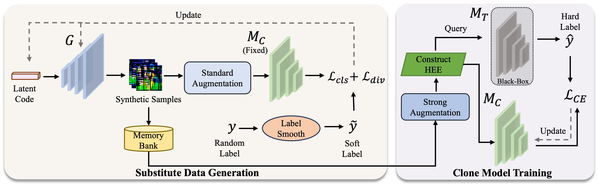
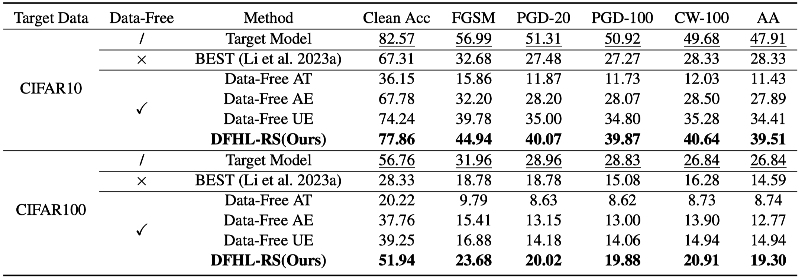

# Data-Free Hard-Label Robustness Stealing Attack

This repo is the official Pytorch implementation for the paper **<a href="https://arxiv.org/abs/2312.05924">Data-Free Hard-Label Robustness Stealing Attack</a> (AAAI
2024)**. 




# Preparation

Pleease download the checkpoints for the target models from:

[[Google Driver]](https://drive.google.com/drive/folders/1kBEcSe0BLu6l2rD3f6ZbK9_n0GhqUSqz?usp=sharing)  [[百度网盘(2rq8)]](https://pan.baidu.com/s/1u3zoAx-WpyCNWEvktMGZAw?pwd=2rq8) 

You need to put them in folder `./checkpoints`.

> If you want to perform adversarial training from scratch, please refer to this repo: [Adversarial_Training_Pytorch](https://github.com/LetheSec/Adversarial_Training_Pytorch/)

# Attack

To perform DFHL-RS and train the clone model, you can run the following commands with default configuration:

- For CIFAR-10:
  ```bash
  python train.py \
  --arch ResNet18 \
  --target_arch ResNet18 \
  --target_defense AT \
  --data CIFAR10 \
  --batch_size 256 \
  --epoch 300 \
  --lr 0.1 \
  --N_C 500 \
  --N_G 10 \
  --lr_G 0.002 \
  --lr_z 0.01 \
  --lr_hee 0.03 \
  --steps_hee 10 \
  --query_mode hee \
  --label_smooth_factor 0.2 \
  --lam 3 \
  --result_dir results
  ```

- For CIFAR-100:

  ```
  python train.py \
  --arch ResNet18 \
  --target_arch ResNet18 \
  --target_defense AT \
  --data CIFAR100 \
  --batch_size 512 \
  --epoch 300 \
  --lr 0.1 \
  --N_C 500 \
  --N_G 15 \
  --lr_G 0.005 \
  --lr_z 0.015 \
  --lr_hee 0.03 \
  --steps_hee 10 \
  --query_mode hee \
  --label_smooth_factor 0.02 \
  --lam 3 \
  --result_dir results
  ```

> By default, robustness evaluation of the clone model will be performed after training is complete, which will take some additional time.


# Results

In a data-free and hard-label setting, the clone model (ResNet18)  obtained by DFHL-RS can achieve **a robustness accuracy of 39.51% under AutoAttack**.




# Citing

If you find this repository useful for your work, please consider citing it as follows:

```bibtex
@inproceedings{yuan2024data,
  title={Data-Free Hard-Label Robustness Stealing Attack},
  author={Yuan, Xiaojian and Chen, Kejiang and Huang, Wen and Zhang, Jie and Zhang, Weiming and Yu, Nenghai},
  booktitle={Proceedings of the AAAI Conference on Artificial Intelligence},
  year={2024}
}
```

